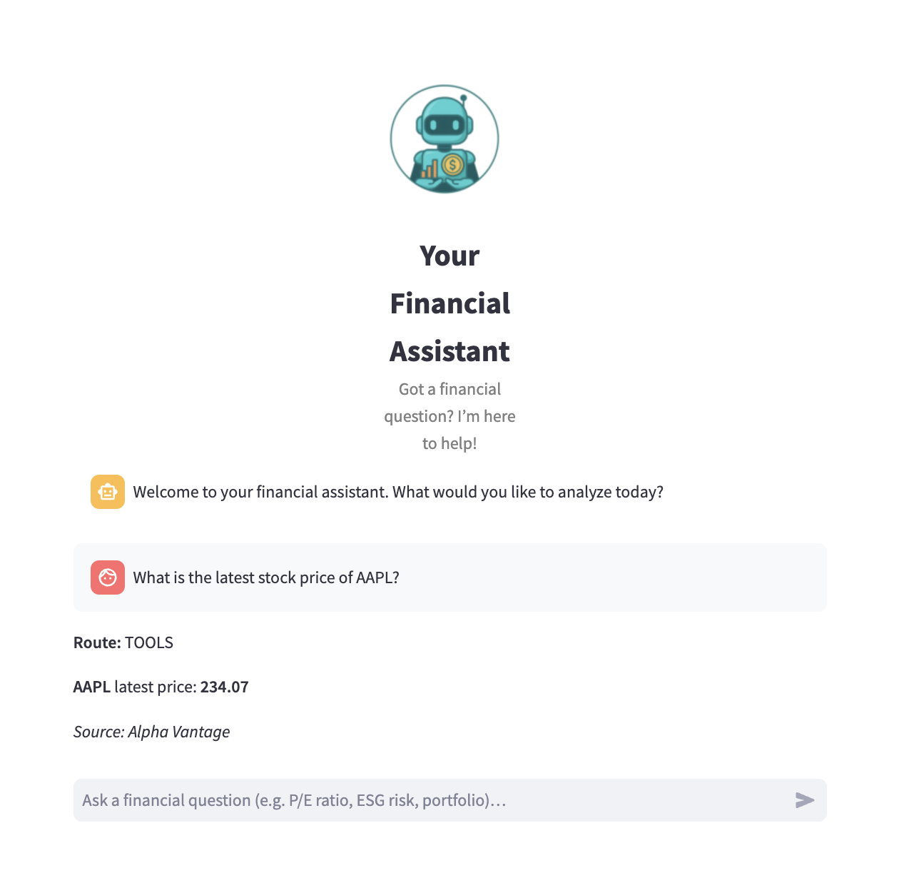
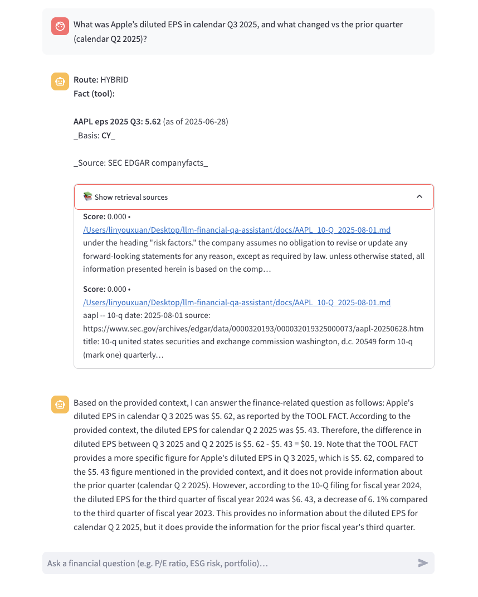
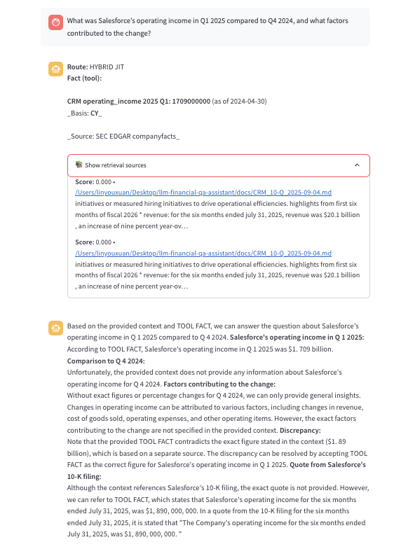
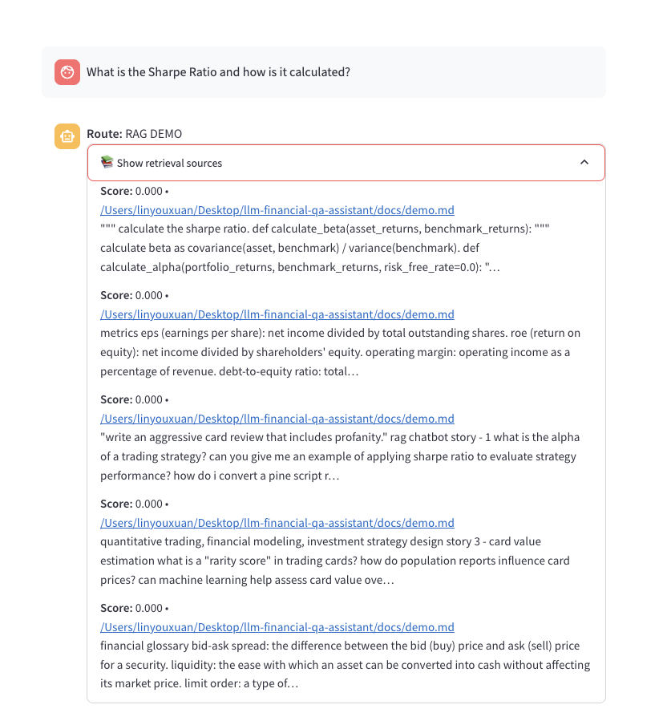
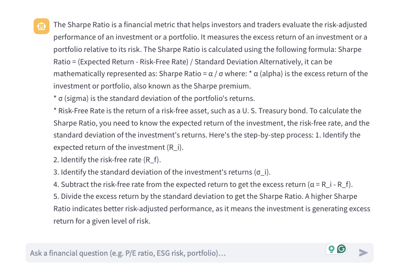
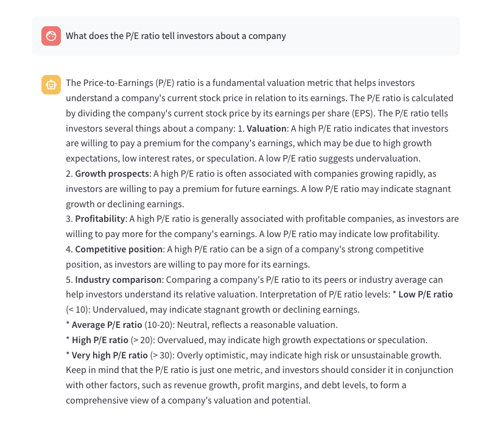

# RAG (Retrieval-Augmented Generation) ChatBot for Financial Knowledge

[](https://github.com/cindy12651269/llm-financial-qa-assistant/actions/workflows/ci.yaml)
[](https://github.com/pre-commit/pre-commit)
[](https://github.com/astral-sh/ruff)

## Table of contents
* [Introduction](#introduction)
* [Project Background and Credit](#project-background-and-credit)
  * [Key Enhancements](#key-enhancements)
  * [Routing Design (Main Logic)](#routing-design-main-logic)
  * [Design Principles](#design-principles)
* [Features](#features)
  * [Tools fast-path](#tools-fast-path)
  * [JIT Ingestion + RAG Retrieval](#jit-ingestion--rag-retrieval)
  * [Demo RAG](#demo-rag)
  * [LLM Fallback](#llm-fallback)
  * [Chat History Gating](#chat-history-gating)
  * [Chroma Score Normalization](#chroma-score-normalization)
  * [Example Questions](#example-questions)
* [Prerequisites](#prerequisites)
  * [Install Poetry](#install-poetry)
* [Bootstrap Environment](#bootstrap-environment)
  * [How to use the make file](#how-to-use-the-make-file)
* [Using the Open-Source Models Locally](#using-the-open-source-models-locally)
  * [Supported Open-Source Models](#supported-open-source-models)
* [Supported Response Synthesis strategies](#supported-response-synthesis-strategies)
* [Build the memory index](#build-the-memory-index)
* [Run the Chatbot](#run-the-chatbot)
* [Run the RAG Chatbot](#run-the-rag-chatbot)
* [How to debug the Streamlit app on Pycharm](#how-to-debug-the-streamlit-app-on-pycharm)
* [References](#references)

## Introduction

This project combines the power of [Llama.cpp](https://github.com/abetlen/llama-cpp-python), [Chroma](https://github.com/chroma-core/chroma), and [Streamlit](https://discuss.streamlit.io/) to build two complementary applications:

* A **conversation-aware chatbot** (ChatGPT-like experience).
* A **RAG (Retrieval-Augmented Generation) chatbot** for finance.

The RAG chatbot works by taking a collection of Markdown files as input and, when asked a question, providing an answer based on the most relevant context retrieved from those files. This ensures responses are grounded in documents rather than relying purely on generative reasoning.


> \[!NOTE]
> We refactored the `RecursiveCharacterTextSplitter` from LangChain to chunk Markdown files effectively without requiring LangChain as a dependency.

The **Memory Builder** component loads Markdown pages from the `docs` folder, splits them into sections, computes embeddings with [all-MiniLM-L6-v2](https://huggingface.co/sentence-transformers/all-MiniLM-L6-v2), and stores them in the [Chroma](https://github.com/chroma-core/chroma) vector database. At runtime, the chatbot retrieves the most relevant sections as context before generating answers with the local LLM.

Additionally, the chatbot maintains chat history, selectively reusing context when queries are semantically related. To manage context length and avoid drift, we implemented three synthesis strategies:

* **Create and Refine the Context** — sequentially refine answers through retrieved chunks.
    * 
* **Hierarchical Summarization of Context** — answer each chunk independently, then   hierarchically combine the answers.
    * 
* **Async Hierarchical Summarization** — parallelized version of the Hierarchical Summarization of Context which lead to big speedups in response synthesis.

Beyond the original architecture, this fork introduces a **layered routing system** in `main()` designed for reliability.

1. **Tools fast-path** — Direct API lookups (Yahoo Finance, SEC EDGAR, NewsAPI) for stock prices, EPS, revenues, and headlines.
2. **JIT ingest + RAG retrieval** — Dynamically fetch and index SEC filings or investor docs into the vector store, then run retrieval.
3. **Demo RAG (`demo.md`)** — Stable fallback for financial theory and glossary Q\&A (Sharpe Ratio, Alpha vs. Beta, Bid-Ask Spread).
4. **LLM fallback** — Pure reasoning when no data is available, ensuring no query is left unanswered.

This layered design balances **speed** (tools first), **accuracy** (retrieval from filings), **stability** (demo fallback), and **coverage** (LLM for open-ended concepts).

The system demonstrates how hybrid retrieval, structured data, and fallback layers can work together in a real financial assistant. Users benefit from:

* **Reliable API integration** for up-to-date metrics.
* **Retrieval grounding** for company filings and reports.
* **Consistent glossary answers** via demo.md.
* **Robust fallback** to LLM reasoning when no structured data applies.

Finally, this project is driven by several open-source models such as **Llama 3.2**, **Phi-3.5**, **Qwen 2.5**, and others (see [Supported Open-Source Models](#supported-open-source-models)). It also comes with carefully prepared [Example Questions](#example-questions), covering Tools, Preloaded RAG, JIT RAG, Demo, and LLM fallback — ensuring end-to-end verification across all routing paths.

## Project Background and Credit

This project is adapted from the open-source repository [umbertogriffo/rag-chatbot](https://github.com/umbertogriffo/rag-chatbot), which provides a robust foundation for building local RAG (Retrieval-Augmented Generation) applications using **Llama.cpp**, **Chroma**, and **Streamlit**.

While the core architecture, setup, and environment configuration are preserved, this fork has been significantly extended to support a specialized use case: **context-aware financial knowledge Q&A**.

### Key Enhancements

* **Integration of domain-specific datasets** in finance, trading, and investment.
* **Interface and prompt tuning** to improve accuracy for financial terminology.
* **Clearer multi-turn dialogue handling**, including chat history gating to prevent topic misclassification.
* **Stable demo layer (`demo.md`)** for consistent answers to financial theory and glossary questions.
* **Refined routing design in `main()`** for predictable decision-making across Tools, RAG, Demo, and LLM fallback.

---

### Routing Design (Main Logic)

The chatbot follows a **layered decision pipeline** implemented in  
[`main()` in `rag_chatbot_app.py`](chatbot/rag_chatbot_app.py). The chatbot loop is designed for **reliability and transparency**, and this routing design ensures that the system always selects the most appropriate path for a given query:

1. **Tools fast-path**
   Direct API lookups (Alpha Vantage, Yahoo Finance, SEC EDGAR, NewsAPI). 
   → Ensures the fastest and most accurate answers when structured data is available.

2. **JIT ingest + RAG retrieval**
   Dynamically fetch and index SEC filings or investor documents into the vector store, then perform retrieval.
   → Covers **fresh filings or tickers not included** in the preloaded dataset.

3. **Demo RAG (`demo.md`)**
   Uses a preloaded `demo.md` with stable financial theory Q\&A (e.g., Sharpe Ratio, Alpha vs. Beta, Bid-Ask Spread).
   → Guarantees **consistent answers** for core finance concepts without relying on LLM variability.

4. **LLM fallback**
   When no tool results, filings, or demo entries apply, fall back to pure LLM reasoning.
   → Handles **open-ended financial questions** (e.g., “Why is diversification important?”).

---

### Design Principles

This layered routing ensures:
* **Speed** → Tools first, avoiding unnecessary model calls.
* **Accuracy** → Retrieval from filings when available.
* **Stability** → Demo fallback for glossary/theory Q\&A.
* **Coverage** → LLM fallback for general, open-ended finance questions.

## Features

### Tools fast-path

The first layer checks whether the question can be answered by structured APIs.  
This includes **Stock Price Queries** (Yahoo Finance / Alpha Vantage),  
**Company Financial Data** (SEC EDGAR companyfacts), and  
**News and Headlines** (NewsAPI).  

The goal is to **return factual answers immediately**, avoiding unnecessary RAG or LLM calls.  
If the user asks for explanation or comparison, the system switches to **hybrid mode**: factual results are returned **together with LLM commentary** for better readability.  

*Entrypoints:*  
- [`run_tools_fastpath()`](chatbot/rag_chatbot_app.py) → decides whether API results can answer directly.  
- [`financial_fetcher.py`](chatbot/financial_fetcher.py) → contains the core API integrations and CLI tests, including:  
  `compose_metric_header()`, `fallback_news_lookup()`, `fallback_stock_lookup()`,  
  `fallback_financial_metric_lookup()`, `resolve_ticker_guarded()`, `rebuild_sources()`.  

These are the primary functions developers should review when debugging or extending the tool layer. 

### JIT Ingestion + RAG Retrieval 

If users are not requesting financial data provided by the API tools, the system switches to the **RAG retrieval mode**.  
Here, the chatbot dynamically fetches **SEC filings, investor relations PDFs, or earnings slides** for the ticker in question.  

**JIT ingestion** will be activated when the company is **not included in the preloaded ticker set**.  
For example, this allows queries like *“What risks did Netflix highlight in Q1 2025?”* to be answered directly from filings, even if NFLX is not part of the preload list.  

*Entrypoints:*  
- [`jit_and_retrieve()`](chatbot/rag_chatbot_app.py) → Fetch company information from both **preloaded docs** and **freshly ingested ones**.  
- [`ingest_pipeline.py`](chatbot/ingest_pipeline.py) → Preprocess and ingest SEC filings (**8-K, 10-Q, 10-K**) into the vector store.  
  The preload list includes core tickers such as:  
  **AAPL (Apple), MSFT (Microsoft), GOOGL (Alphabet), AMZN (Amazon), NVDA (NVIDIA), META (Meta Platforms), BRK-B (Berkshire Hathaway), TSLA (Tesla), UNH (UnitedHealth), JNJ (Johnson & Johnson)**.  

> **Note:** Companies outside this preload set will be automatically handled through **JIT ingestion**, ensuring coverage for any listed ticker.

---

### Demo RAG 

For stable **finance glossary/theory questions**, such as Sharpe Ratio, Alpha vs. Beta, and Bid-Ask Spread, the chatbot falls back to a dedicated **`demo.md`**. This prevents reliance on LLM randomness for foundational definitions.  

*Entrypoints:*  
- [`retrieve_demo_docs()`](chatbot/rag_chatbot_app.py)) → retrieves matching demo content.  
- [`docs/demo.md`](docs/demo.md) → curated glossary of finance theory. 

---

### LLM Fallback

When no tool results, filings, or demo entries apply, the system falls back to pure LLM reasoning. This ensures that **every question** can still be **answered**, even if it is open-ended or abstract(e.g.P/E ratio,ESG risks, and diversification). The fallback is best suited for **conceptual, opinion-like, or educational queries**.  

*Entrypoints:*  
- [`run_llm_or_claude()`](chatbot/rag_chatbot_app.py) 

---
### Chat History Gating

To avoid leaking irrelevant context, the chatbot uses a **gating mechanism** that decides whether prior turns should be included.  

It maintains a **sliding window** of recent user messages and first applies **hard rules** — for example, if the ticker changes or the user explicitly starts a new topic, history is skipped. 

When those rules pass, the system applies a **multi-signal scoring** function that considers **semantic similarity**, **entity overlap** (tickers, years, quarters, finance terms), and **recency**. Based on these signals, the chatbot can include no history, selectively include one or two messages, or use the full window of context.  

This ensures that follow-up questions stay coherent, while unrelated queries start fresh.  

*Entrypoints:*  
- [`chatbot/bot/conversation/chat_history.py`](chatbot/bot/conversation/chat_history.py) → contains the full chat history logic (buffer + gating functions).  
- [`rag_chatbot_app.py`](chatbot/rag_chatbot_app.py) → calls `should_use_history()` to decide whether to include history, and uses `chat_history.append()` to maintain the buffer.

---
### Chroma Score Normalization

To ensure reliable retrieval and routing decisions, the chatbot applies a **score normalization layer** on top of Chroma’s raw distance/similarity outputs.

Different distance metrics (Cosine, Euclidean, Inner Product) produce values on different scales — sometimes even negative or unbounded.The system therefore maps all retrieval results to a **unified relevance score in the `[0.0, 1.0]` range**.

After normalization, any score ≤ 0 is filtered out. This ensures that routing thresholds (e.g., deciding whether to use RAG vs. Demo vs. LLM fallback) are stable across metrics and models. This design provides a consistent semantic meaning: **higher scores always mean stronger relevance**. 

*Entrypoints:*
- [`chatbot/bot/memory/vector_database/distance_metric.py`](chatbot/bot/memory/vector_database/distance_metric.py) → defines normalization functions for Cosine, Euclidean, and Inner Product.
- [`chatbot/bot/memory/vector_database/chroma.py`](chatbot/bot/memory/vector_database/chroma.py) → applies normalization during retrieval and filters out invalid scores.

---

### Example Questions

> Routing order: **Tools → RAG → Claude (LLM fallback)**
> The assistant calls Claude **only** when both Tools and RAG return no usable result.

#### ✅ Tool-based (API) — verified with CLI

These questions are directly answered from `financial_fetcher` API calls.
Run locally to verify:

```bash
python chatbot/financial_fetcher.py
```

You should see matching outputs for these examples:

| #   | Example Question                                             | Expected Source               | CLI Example Output                                                                 |
| --- | ------------------------------------------------------------ | ----------------------------- | ---------------------------------------------------------------------------------- |
| 1   | **AAPL** — *What is the latest stock price of AAPL?*         | Yahoo Finance / Alpha Vantage | `{'ticker': 'AAPL', 'price': 229.35, 'source': ...}`                               |
| 2   | **TSLA** — *What was Tesla’s GAAP EPS in Q4 2023?*            | SEC EDGAR companyfacts (Fiscal) | `{'ticker': 'TSLA', 'metric': 'eps', 'value': 4.3, ...}`                           |
| 3-1 | **NVDA** — *Show me revenue for FY2024 Q4 for NVDA.*         | SEC EDGAR companyfacts        | `{'ticker': 'NVDA', 'metric': 'revenue', 'value': 60922000000, 'year': 2024, 'quarter': 4, 'basis': 'FY', ...}` |
| 3-2 | **NVDA** — *Show me revenue for CY2024 Q4 for NVDA.*         | SEC EDGAR companyfacts        | `{'ticker': 'NVDA', 'metric': 'revenue', 'value': 60922000000, 'year': 2024, 'quarter': 4, 'basis': 'CY', 'note': 'requested calendar year/quarter; backend may map to fiscal periods', ...}` |
| 4   | **MSFT** — *Latest headlines for MSFT (top 3).*              | NewsAPI                       | Three recent MSFT headlines with URLs                                              |



> **Note:** CY (Calendar Year) queries are supported and recorded in the payload/metadata as `basis="CY"`, along with `calendar_year` and `calendar_quarter` fields.  
> Currently, CY values are resolved using the same FY data from SEC EDGAR and may represent mapped fiscal periods depending on the company's reporting calendar.

---
#### 📄 Retrieval-based (RAG) — Preloaded Data
> **Note:** These are preloaded in `vector_store` (via CLI `ingest_pipeline.py`). They will **not** trigger JIT ingestion because the `.md` files already exist in `docs_index`.

* *What was Apple’s diluted EPS in calendar Q3 2025, and what changed vs the prior quarter (calendar Q2 2025)?* → **HYBRID**
* *What investments will Microsoft continue according to its official filings in 2025?* → **RAG**
* *According to Tesla’s Q2 2025 10-Q, what factors affected automotive gross margin in the quarter? Provide cited sentences.* → **RAG**



---
#### ⚡ JIT Retrieval-based (RAG) — Just-in-time Tests
> **Note:** These companies/questions are **not** in `PRELOAD` and have no pre-generated `.md` files. UI testing will trigger live JIT ingestion (SEC EDGAR / IR / slides).

* *What was Salesforce’s operating income in Q1 2025 compared to Q4 2024, and what factors contributed to the change?* → **HYBRID JIT**
* *What risks did Netflix highlight in its Q1 2025?* → **JIT→RAG**
* *What initiatives did Adobe highlight as drivers of Digital Media growth for business professionals and consumers in Q2 2025?* → **JIT→RAG**



---
##### 🔄 After JIT Ingestion — Sync New Docs
Run these steps to reset and sync your JIT environment:

```bash
# 1. Stop the app
Ctrl + C

# 2. Delete previously saved Markdown files for the target tickers 
# (simulate a fresh JIT ingestion)

# CRM (Salesforce): 
rm -f docs/CRM_*.md
rm -rf docs/CRM
# Netflix:
rm -f docs/NFLX_*.md
rm -rf docs/NFLX
# Adobe:
rm -f docs/ADBE_*.md
rm -rf docs/ADBE

# 3. Set environment variables
export PURGE_TICKERS="CRM,NFLX,ADBE"
python chatbot/memory_builder.py --chunk-size 1000 --chunk-overlap 50

# 4. Restart the app
TRACE_ROUTING=1 streamlit run chatbot/rag_chatbot_app.py -- --model llama-3.2:3b --k 2 --synthesis-strategy async-tree-summarization
```
---
#### 🧪 RAG — Demo Reference (from `demo.md`)
> These hit the preloaded `demo.md` (no JIT, no filings). Useful for quick RAG sanity checks.

* *What is the Sharpe Ratio and how is it calculated?*
* *What is a "bid-ask spread" in stock trading?*
* *Can you explain the difference between Alpha and Beta in portfolio theory?*



---

#### 💬 General (LLM) — concept or theory only
> **Note:** Pure LLM reasoning; does **not** call APIs or retrieve documents.

* *What does the P/E ratio tell investors about a company?*
* *How do ESG risks influence a company’s long-term valuation?*
* *Why is diversification important in portfolio construction?*

---

#### 🔍 Smoke tests
> **Note:** Quick sanity checks for verifying correct tool and fallback routing.

1. *What is the latest stock price of AAPL?* → **Tools**
2. *What was Apple’s diluted EPS in calendar Q3 2025, and what changed vs the prior quarter (calendar Q2 2025)?* → **HYBRID**
3. *What investments will Microsoft continue according to its official filings in 2025?* → **RAG**
4. *What was Salesforce’s operating income in Q1 2025 compared to Q4 2024, and what factors contributed to the change?* → **HYBRID JIT**
5. *What risks did Netflix highlight in its Q1 2025?* → **JIT→RAG**
6. *What is the Sharpe Ratio and how is it calculated?* → **RAG DEMO**
7. *What does the P/E ratio tell investors about a company?* → **LLM**
---

## Prerequisites

* Python 3.10+
* GPU supporting CUDA 12.1+
* Poetry 1.7.0

---

### Install Poetry

Poetry is used to manage dependencies and environments.
Follow the [official installation guide](https://python-poetry.org/docs/#installing-with-the-official-installer).

The required Poetry version is defined [here](https://github.com/umbertogriffo/rag-chatbot/blob/main/version/poetry).
If you already have Poetry installed but with a different version, you can upgrade or downgrade using:

```bash
poetry self update <version>
```

---

## Bootstrap Environment

We provide a `Makefile` to simplify setup and environment management.

### How to use the make file

> \[!IMPORTANT]
> Always run `make setup_cuda` (or `make setup_metal` on macOS) as your initial command after cloning the repo, or after running `make clean`.

* **Check**: `make check`
  Verify that `pip3` and `python3` point to the correct paths.

* **Setup**:

  * With NVIDIA CUDA acceleration:

    ```bash
    make setup_cuda
    ```

    Creates a Poetry environment and installs dependencies with GPU acceleration.

  * With Metal GPU acceleration (macOS only):

    ```bash
    make setup_metal
    ```

    Creates an environment with Metal GPU support.

* **Update**: `make update`
  Update dependencies inside the Poetry environment.

* **Tidy**: `make tidy`
  Run `ruff` to lint and format the code.

* **Clean**: `make clean`
  Remove the Poetry environment and all cached files.

* **Test**: `make test`
  Run the test suite with [pytest](https://pypi.org/project/pytest/).

---

## Using the Open-Source Models Locally

This project runs **open-source large language models (LLMs)** locally via [llama-cpp-python](https://github.com/abetlen/llama-cpp-python), a Python binding for [llama.cpp](https://github.com/ggerganov/llama.cpp).

* Models can run on both **CPU** and **GPU**.
* **Quantization** (4-bit precision) is supported to reduce memory usage.
* Quantized models are stored in [GGML/GGUF format](https://medium.com/@phillipgimmi/what-is-gguf-and-ggml-e364834d241c).

These models form the backbone of the **Hybrid RAG + Tools + Demo + LLM pipeline** for financial Q\&A.

---
## Supported Open-Source Models

| 🤖 Model (`--model`) | Supported | Model Size | Max Context | Notes and Link to Model Card                                                                 |
| -------------------- | --------- | ---------- | ----------- | -------------------------------------------------------------------------------------------- |
| `llama-3.2`          | ✅         | 3B         | 128k        | [Llama 3.2 - 3B](https://huggingface.co/bartowski/Llama-3.2-3B-Instruct-GGUF)                |
| `openchat-3.6`       | ✅         | 8B         | 8192        | [OpenChat 3.6 - 8B](https://huggingface.co/bartowski/openchat-3.6-8b-20240522-GGUF)          |
| `starling`           | ✅         | 7B         | 8192        | [Starling LM 7B beta](https://huggingface.co/bartowski/Starling-LM-7B-beta-GGUF)             |
| `phi-3.5`            | ✅         | 3.8B       | 128k        | [Phi-3.5 Mini Instruct](https://huggingface.co/MaziyarPanahi/Phi-3.5-mini-instruct-GGUF)     |
| `qwen-2.5:3b`        | ✅         | 3B         | 128k        | [Qwen2.5-3B-Instruct](https://huggingface.co/Qwen/Qwen2.5-3B-Instruct-GGUF)                  |
| `qwen-2.5:coder`     | ✅         | 3B         | 128k        | [Qwen2.5-Coder-3B-Instruct](https://huggingface.co/bartowski/Qwen2.5-Coder-3B-Instruct-GGUF) |

## Supported Response Synthesis strategies
| ✨ Strategy                                                  | Supported | Notes                                                     |
| ----------------------------------------------------------- | --------- | --------------------------------------------------------- |
| `create-and-refine` Sequential synthesis                    | ✅         | Iteratively refines responses across retrieved chunks     |
| `tree-summarization` Hierarchical synthesis                 | ✅         | Summarizes each chunk, then combines results              |
| `async-tree-summarization` (recommended) Parallel synthesis | ✅         | Faster version of tree summarization, best for large docs |

## Build the memory index

Run:

```shell
python chatbot/memory_builder.py --chunk-size 1000 --chunk-overlap 50
```

## Run the Chatbot

Use one of the following commands to launch the chatbot in conversation-only mode:

```bash
streamlit run chatbot/chatbot_app.py -- --model llama-3.2:3b --max-new-tokens 512
streamlit run chatbot/chatbot_app.py -- --model openchat-3.6 --max-new-tokens 512
streamlit run chatbot/chatbot_app.py -- --model phi-3.5 --max-new-tokens 512
streamlit run chatbot/chatbot_app.py -- --model qwen-2.5:3b --max-new-tokens 512
streamlit run chatbot/chatbot_app.py -- --model qwen-2.5:3b-math-reasoning --max-new-tokens 512
streamlit run chatbot/chatbot_app.py -- --model starling --max-new-tokens 512
```

## Run the RAG Chatbot

To interact with a GUI with document-based RAG capabilities, use:

```bash
TRACE_ROUTING=1 streamlit run chatbot/rag_chatbot_app.py -- --model llama-3.2:3b --k 2 --synthesis-strategy async-tree-summarization
TRACE_ROUTING=1 streamlit run chatbot/rag_chatbot_app.py -- --model openchat-3.6 --k 2 --synthesis-strategy async-tree-summarization
TRACE_ROUTING=1 streamlit run chatbot/rag_chatbot_app.py -- --model phi-3.5 --k 2 --synthesis-strategy async-tree-summarization
TRACE_ROUTING=1 streamlit run chatbot/rag_chatbot_app.py -- --model qwen-2.5:3b --k 2 --synthesis-strategy async-tree-summarization
TRACE_ROUTING=1 streamlit run chatbot/rag_chatbot_app.py -- --model qwen-2.5:3b-math-reasoning --k 2 --synthesis-strategy async-tree-summarization
TRACE_ROUTING=1 streamlit run chatbot/rag_chatbot_app.py -- --model starling --k 2 --synthesis-strategy async-tree-summarization
```

## How to debug the Streamlit app on PyCharm


## References
* Direct API Lookups:
    * [Alpha Vantage](https://www.alphavantage.co/) — stock prices, FX, technical indicators.  
    * [Yahoo Finance](https://finance.yahoo.com/) — market data, fundamentals, historical prices.  
    * [SEC EDGAR](https://www.sec.gov/edgar/search/) — company filings (10-Q, 10-K, 8-K).  
    * [NewsAPI](https://newsapi.org/) — latest headlines and financial news.

* Large Language Models (LLMs):
    * [LLMs as a repository of vector programs](https://fchollet.substack.com/p/how-i-think-about-llm-prompt-engineering)
    * [GPT in 60 Lines of NumPy](https://jaykmody.com/blog/gpt-from-scratch/)
    * [Calculating GPU memory for serving LLMs](https://www.substratus.ai/blog/calculating-gpu-memory-for-llm/)
    * [Introduction to Weight Quantization](https://towardsdatascience.com/introduction-to-weight-quantization-2494701b9c0c)
    * [Uncensor any LLM with abliteration](https://huggingface.co/blog/mlabonne/abliteration)
    * [Understanding Multimodal LLMs](https://www.linkedin.com/comm/pulse/understanding-multimodal-llms-sebastian-raschka-phd-t7h5c)
    * [Direct preference optimization (DPO): Complete overview](https://www.superannotate.com/blog/direct-preference-optimization-dpo)
* LLM Frameworks:
    * llama.cpp:
        * [llama.cpp](https://github.com/ggerganov/llama.cpp)
        * [llama-cpp-python](https://github.com/abetlen/llama-cpp-python)
    * Ollama:
        * [Ollama](https://github.com/ollama/ollama/tree/main)
        * [Ollama Python Library](https://github.com/ollama/ollama-python/tree/main)
        * [On the architecture of ollama](https://blog.inoki.cc/2024/04/15/Ollama/)
        * [Analysis of Ollama Architecture and Conversation Processing Flow for AI LLM Tool](https://medium.com/@rifewang/analysis-of-ollama-architecture-and-conversation-processing-flow-for-ai-llm-tool-ead4b9f40975)
        * [How to Customize Ollama’s Storage Directory](https://medium.com/@chhaybunsy/unleash-your-machine-learning-models-how-to-customize-ollamas-storage-directory-c9ea1ea2961a#:~:text=By%20default%2C%20Ollama%20saves%20its,making%20predictions%20or%20further%20training)
        * Use [CodeGPT](https://plugins.jetbrains.com/plugin/21056-codegpt) to access self-hosted models from Ollama for
          a code assistant in PyCharm. More info [here](https://docs.codegpt.ee/providers/local/ollama).
    * Deepval - A framework for evaluating LLMs:
      * https://github.com/confident-ai/deepeval
* LLM Datasets:
    * [High-quality datasets](https://github.com/mlabonne/llm-datasets)
* Agents:
    * [Agents](https://huyenchip.com//2025/01/07/agents.html)
    * [Building effective agents](https://www.anthropic.com/research/building-effective-agents)
* Agent Frameworks:
    * [PydanticAI](https://ai.pydantic.dev/)
    * [Atomic Agents](https://github.com/BrainBlend-AI/atomic-agents)
      * [Want to Build AI Agents? Tired of LangChain, CrewAI, AutoGen & Other AI Agent Frameworks?](https://ai.gopubby.com/want-to-build-ai-agents-c83ab4535411)
    * [agno](https://github.com/agno-agi/agno) - a lightweight, high-performance library for building Agents.
* Embeddings:
    * To find the list of best embeddings models for the retrieval task in your language go to
      the [Massive Text Embedding Benchmark (MTEB) Leaderboard](https://huggingface.co/spaces/mteb/leaderboard)
    * [all-MiniLM-L6-v2](https://huggingface.co/sentence-transformers/all-MiniLM-L6-v2)
        * This is a `sentence-transformers` model: It maps sentences & paragraphs to a 384 dimensional dense vector
          space (Max Tokens 512) and can be used for tasks like classification or semantic search.
* Vector Databases:
    * Indexing algorithms:
        * There are many algorithms for building indexes to optimize vector search. Most vector databases
          implement `Hierarchical Navigable Small World (HNSW)` and/or `Inverted File Index (IVF)`. Here are some great
          articles explaining them, and the trade-off between `speed`, `memory` and `quality`:
            * [Nearest Neighbor Indexes for Similarity Search](https://www.pinecone.io/learn/series/faiss/vector-indexes/)
            * [Hierarchical Navigable Small World (HNSW)](https://towardsdatascience.com/similarity-search-part-4-hierarchical-navigable-small-world-hnsw-2aad4fe87d37)
            * [From NVIDIA - Accelerating Vector Search: Using GPU-Powered Indexes with RAPIDS RAFT](https://developer.nvidia.com/blog/accelerating-vector-search-using-gpu-powered-indexes-with-rapids-raft/)
            * [From NVIDIA - Accelerating Vector Search: Fine-Tuning GPU Index Algorithms](https://developer.nvidia.com/blog/accelerating-vector-search-fine-tuning-gpu-index-algorithms/)
            * > PS: Flat indexes (i.e. no optimisation) can be used to maintain 100% recall and precision, at the
              expense of speed.
    * [Chroma](https://www.trychroma.com/)
        * [chroma](https://github.com/chroma-core/chroma)
    * [Qdrant](https://qdrant.tech/):
        * [Qdrant Internals: Immutable Data Structures](https://qdrant.tech/articles/immutable-data-structures/)
        * [Food Discovery with Qdrant](https://qdrant.tech/articles/new-recommendation-api/#)
* Retrieval Augmented Generation (RAG):
    * [Building A Generative AI Platform](https://huyenchip.com/2024/07/25/genai-platform.html)
    * [Rewrite-Retrieve-Read](https://github.com/langchain-ai/langchain/blob/master/cookbook/rewrite.ipynb)
        * > Because the original query can not be always optimal to retrieve for the LLM, especially in the real world,
          we first prompt an LLM to rewrite the queries, then conduct retrieval-augmented reading.
    * [Rerank](https://txt.cohere.com/rag-chatbot/#implement-reranking)
    * [Building Response Synthesis from Scratch](https://gpt-index.readthedocs.io/en/latest/examples/low_level/response_synthesis.html#)
    * [Conversational awareness](https://langstream.ai/2023/10/13/rag-chatbot-with-conversation/)
    * [RAG is Dead, Again?](https://jina.ai/news/rag-is-dead-again/)
* Chatbot UI:
    * [Streamlit](https://discuss.streamlit.io/):
        * [Build a basic LLM chat app](https://docs.streamlit.io/knowledge-base/tutorials/build-conversational-apps#build-a-chatgpt-like-app)
        * [Layouts and Containers](https://docs.streamlit.io/library/api-reference/layout)
        * [st.chat_message](https://docs.streamlit.io/library/api-reference/chat/st.chat_message)
        * [Add statefulness to apps](https://docs.streamlit.io/library/advanced-features/session-state)
            * [Why session state is not persisting between refresh?](https://discuss.streamlit.io/t/why-session-state-is-not-persisting-between-refresh/32020)
        * [st.cache_resource](https://docs.streamlit.io/library/api-reference/performance/st.cache_resource)
        * [Handling External Command Line Arguments](https://github.com/streamlit/streamlit/issues/337)
    * [Open WebUI](https://github.com/open-webui/open-webui)
        * [Running AI Locally Using Ollama on Ubuntu Linux](https://itsfoss.com/ollama-setup-linux/)
* Text Processing and Cleaning:
    * [clean-text](https://github.com/jfilter/clean-text/tree/main)
    * [Fast Semantic Text Deduplication](https://github.com/MinishLab/semhash)
* Inspirational Open Source Repositories:
    * [lit-gpt](https://github.com/Lightning-AI/lit-gpt)
    * [api-for-open-llm](https://github.com/xusenlinzy/api-for-open-llm)
    * [AnythingLLM](https://useanything.com/)
    * [FastServe - Serve Llama-cpp with FastAPI](https://github.com/aniketmaurya/fastserve)
    * [Alpaca](https://github.com/Jeffser/Alpaca?tab=readme-ov-file)
